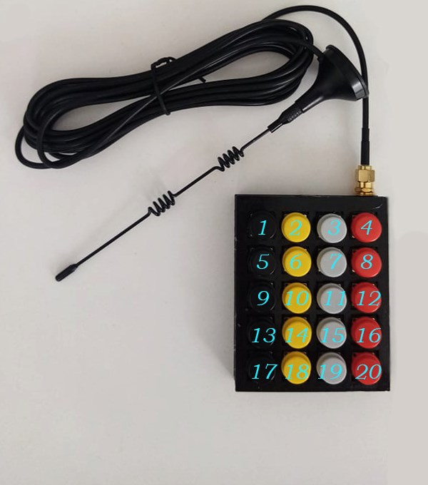

# Etere Documentation 
This page describes etereshop controller software.
During time this software changed multiple times, this documentation version describes 8th software version.  
Due to backwards compatibility this instructions can be applied to previous software versions.

## STANDART CONTROL

 
Specification

Available for controllers:

    -ESP8266
    -ESP32
    
With this type of control, changing the effects is carried out by pressing the buttons of the controller itself   
    
### Simple mode

 
Description

For a simple stand-alone mode with switching the effect using a button, the configuration file should contain the following line:

    play.default=0;

    or

    play.default=Manual;

    or nothing

### Auto-switch mode

 
Description

When the mode is active, your controller will cycle through effects in an endless loop every N seconds.
To activate this mode, set the following line in the configuration file:

    play.default=2;

    or

    play.default=Auto;

You also need to create an `auto.txt` file and write the time value in milliseconds to this file. Example: 

    15000 - effects will switch every 15 seconds.

To activate automatic switching of effects after turning on the product, you just need to press the button of the switching effect.

To activate the blackout effect, you need to press and hold any button for about 1.5-2 seconds.
Blackout effect - the effect at which all LEDs go out

> **Note:** LEDs continue to consume power while playing the blackout effect

### Playlist mode

 
Description

You also can program your own show. 
To activate this mode, set the following line in the configuration file:

    play.default=1;
    
    or
    
    play.default=Playlist;

Also, you need to create an auto.txt file and write the number of effects and the time when the effect should be switched after the start of the show in this file. The show starts after clicking the switch effect button.
    
`show.txt` file example:
    
    1, 0:00
    2, 0:10			| Effect with the name S2 can't be found on sd Card -> ignoring
    3, 0:25			| Activate effect S3 after 25 seconds from click.
    0, 0:30			| Activate blackout at 30th second from click.
    4, 0:31			| Activate S4 at second 31
    12, 0:35:541		| Activate S12 at 35.541
    1, 40100		| Activate S1 in 41.1 seconds after click (time in msec)
    0, 0:50			| Activate blackout at 50th second
    3, 1:05			| Activate S3 at 1:05, this effect will be active until you turn off the controller.

How it works:

    Set S1 effect at the start (0th second) from button click
    Set S2 effect at 10th second.
    Set S3 effect at 25th second.
    Set blackout effect at 30th second.
    ...
    
Remember to set the dimming effect (number 0) at the end if you want to turn off the LEDs at the end of the show.    
To do this, press and hold the button for about 1.5-2 seconds.

If the controller cannot find an effect by the sequence number specified in the playlist, that effect will be ignored. The previous effect will continue to play.

### Test mode

 
Description

Service mode for testing and detecting problems with LEDs.

> **Note:** This mode is not custom

    play.default=3;
    or
    play.default=Test;

   

## RADIO CONTROL
    

 
Specification
  
Radio control is an extension of the standard control.
    
To enable the radio, add the following line to the configuration file:

   - if the controller should only listen to the radio channel;

       `radio.pattern=input;`

   - if the controller only needs to send a radio signal to other receivers;
    
       `radio.pattern=output;`

   - if the controller must simultaneously listen to the radio and send it to other receivers;

       `radio.pattern=group;` 

The radio signal only transmits the effect number. If the controller receives this value, it must change the current effect number to the received number and play that effect assuming that it exists on the controller's memory card.
    
In output mode and group mode, the controller will send the effect value if it was changed by pressing the effect switch button (not applicable to special transmitter controllers such as DMX-RF 20-button remote controller).    
    
### Radio module settings
    

 
Description

If you have several groups of radio-controlled LED products and want to control them independently, you can change the radio channels. Signals from different channels do not overlap with each other.
    
To change the radio channel, you need to add the following line to the config file:

`radio.channel=#;`

Where # is the number of the channel that can range from 1 to 127.

Default channel is 1;

    
### Advanced settings    

 
Description

You can also create virtual subchannels. This option has been added to use multiple DMX channels to control LED products with a DMX-RF transmitter.

Advanced settings are activated by adding the following code to the config file:

`radio.version=1;`

The number of subchannels is regulated by the following line:
    
`radio.v1.bits=#;`    
    
Where # - subchannel mode, it must be between 1 and 4:
    
    - If 1: up to 2 subchannels but 127 numbers of effects max.
    - If 2: up to 4 subchannels but 63 numbers of effects max.
    - If 3: up to 8 subchannels but 31 numbers of effects max.
    - If 4: up to 16 subchannels but 15 numbers of effects max.
    
All receivers must have the same settings. If the transmitter sends a radio signal to 5 receivers, then each receiver should have 
    radio.v1.bits = 3 (4 < 5 < 8).

`radio.v1.address=0;`
Subchannel address for the receiver.
    - If radio.v1.bits=1 then value in range from 0 to 1;
    - If radio.v1.bits=2 then value in range from 0 to 3;
    - If radio.v1.bits=3 then value in range from 0 to 7;
    - If radio.v1.bits=4 then value in range from 0 to 15;
    
`radio.v1.reset=0;`
Blackout/stop value. We recommend that you do not change this value.

`radio.v1.output=[0,1];`
Output address [addr,addr,addr] for output and group modes.

### Integration with standalone modes    

 
Description
    

Simple standalone mode
Works autonomously as usual. In radio group mode or output mode, if you press a button to change the effect, the controller also sends a signal to other LED products to change the effect to the same number.
The number of effects must be the same on each controller, otherwise switching to the missing effect will be ignored. A long press on the button will stop the effects playback.

Auto and show/playlist mode

A short press of the button sends a signal to start playback of the sequence to each controller-listener. A long press on the button will stop the effects playback.

Possible types of radio transmitters:
    
   
 
Description
     
    
   - Twenty button console
    
        
 
Description
 
  
         
        
        The remote control consists of: a controller box unit with 20 buttons, an external radio antenna 433MHz, a power bank, a USB cable.    
        
        There are 2 versions of the remote control: for 20 effects and for 36 effects.

        Version with 20 effects: each button triggers one effect from 1 to 20.

        Version with 36 effects: 
            
            18 buttons for switching effects, 2 buttons for setting page 1 or 2. 
            If page #1 is selected: buttons 1-18 → effects 1-18. 
            If page # 2 is selected: buttons 1-18 → effects 19-36.
            
        The radio channel cannot be changed by hardware restrictions.
    
        

    
   - DMX device
   
        [**Manual**](https://github.com/etereman/-controller-documentation-control-types-/blob/main/README.md#standart-control).

  
    

    
       
## WIFI REAL-TIME CONTROL    
       

 
Specification
      
    
Available on ESP8266 and ESP32.

Network data type: Art-Net packets.

Limitations:
    
  - ESP8266 - 680 LEDs or 4 universes
  - ESP32 - 1700 LEDs or 10 universes (it is recommended to use fewer LEDs for more stability)
   
Universe is an Artnet networking package containing data for 170 LEDs.
Supported WiFi protocols: IEEE 802.11b/g/n.

### WiFi settings for config.txt file
    

 
Description
    

`wifi.mode=sta;`
    
`'sta'` or `'ap'`. This means that the controller must be connected to the user’s Wi-Fi hotspot, otherwise, the controller will create its own hotspot with the parameters shown below. We recommend using the `"sta"` mode.
Warning! Signal quality and network stability largely depend on the hardware of your access point! A regular cheap home router may not be enough for your tasks.

`wifi.ssid=Point1234;`
Access point name.

`wifi.password=pass4321;`
Access point password.

`wifi.ip=192.168.1.99;`
IP address of controller in network.

`wifi.netmask=255.255.255.0;`
Standard network mask, no need to change in most situations.

`wifi.gateway=192.168.1.1;`
Same as IP, but the last number may be any from 0 to 255. The gateway is only needed to work over the Internet. There is no internet functionality at this moment.

`play.defaultPlayMode=4;`
or
`play.defaultPlayMode=Art-Net;`
Sets this mode as default mode.

    
    
    
## LAN realtime control        
    

 
Specification
 
   
Only is supported by ESP32.

Limitations: 4760 LEDs or 28 universes for stable operation, but more than 40 universes are possible (6800 LEDs).
    
Warning! More LEDs -> less stability and lower frame rates -> more freezes or controller reboots.

### LAN Settings for config.txt file

`wifi.mode=eth;`
Enable LAN hardware.

`wifi.ip=192.168.1.99;`
IP address of controller within the network.

`wifi.netmask=255.255.255.0;`
Standard network mask, no need to change it in most situations.

`wifi.gateway=192.168.1.1;`
Same as IP, but the last number may be any from 0 to 255. The gateway is only needed to work over the Internet. There is no internet functionality at this moment.

`play.defaultPlayMode=4;` or `play.defaultPlayMode=Art-Net;`
    
Sets this mode as default mode.
    

    
