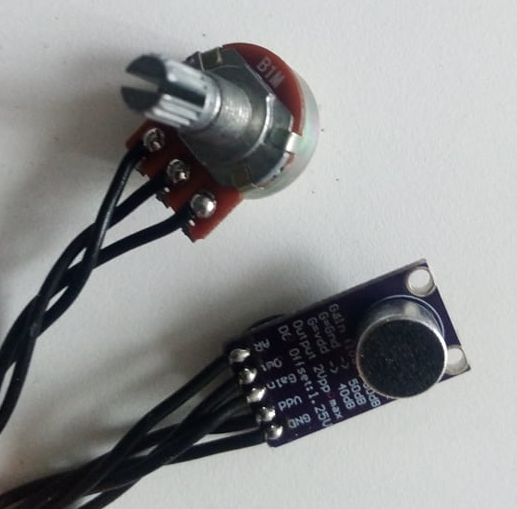

# Etere Documentation 
This page describes etereshop controller software.
During time this software changed multiple times, this documentation version describes 8th software version.  
Due to backwards compatibility this instructions can be applied to previous software versions.

## STANDART CONTROL

 
Specification

Available for controllers:

    -ESP8266
    -ESP32
    
With this type of control, changing the effects is carried out by pressing the buttons of the controller itself   
    
### Simple mode

 
Description

For a simple stand-alone mode with switching the effect using a button, the configuration file should contain the following line:

    play.default=0;

    or

    play.default=Manual;

    or nothing

### Auto-switch mode

 
Description

When the mode is active, your controller will cycle through effects in an endless loop every N seconds.
To activate this mode, set the following line in the configuration file:

    play.default=2;

    or

    play.default=Auto;

You also need to create an `auto.txt` file and write the time value in milliseconds to this file. Example: 

    15000 - effects will switch every 15 seconds.

To activate automatic switching of effects after turning on the product, you just need to press the button of the switching effect.

To activate the blackout effect, you need to press and hold any button for about 1.5-2 seconds.
Blackout effect - the effect at which all LEDs go out

> **Note:** LEDs continue to consume power while playing the blackout effect

### Playlist mode

 
Description

You also can program your own show. 
To activate this mode, set the following line in the configuration file:

    play.default=1;
    
    or
    
    play.default=Playlist;

Also, you need to create an auto.txt file and write the number of effects and the time when the effect should be switched after the start of the show in this file. The show starts after clicking the switch effect button.
    
`show.txt` file example:
    
    1, 0:00
    2, 0:10			| Effect with the name S2 can't be found on sd Card -> ignoring
    3, 0:25			| Activate effect S3 after 25 seconds from click.
    0, 0:30			| Activate blackout at 30th second from click.
    4, 0:31			| Activate S4 at second 31
    12, 0:35:541		| Activate S12 at 35.541
    1, 40100		| Activate S1 in 41.1 seconds after click (time in msec)
    0, 0:50			| Activate blackout at 50th second
    3, 1:05			| Activate S3 at 1:05, this effect will be active until you turn off the controller.

How it works:

    Set S1 effect at the start (0th second) from button click
    Set S2 effect at 10th second.
    Set S3 effect at 25th second.
    Set blackout effect at 30th second.
    ...
    
Remember to set the dimming effect (number 0) at the end if you want to turn off the LEDs at the end of the show.    
To do this, press and hold the button for about 1.5-2 seconds.

If the controller cannot find an effect by the sequence number specified in the playlist, that effect will be ignored. The previous effect will continue to play.

### Test mode

 
Description

Service mode for testing and detecting problems with LEDs.

> **Note:** This mode is not custom

    play.default=3;
    or
    play.default=Test;

   

## RADIO CONTROL
    

 
Specification
  
Radio control is an extension of the standard control.
    
To enable the radio, add the following line to the configuration file:

   - if the controller should only listen to the radio channel;

       `radio.pattern=input;`

   - if the controller only needs to send a radio signal to other receivers;
    
       `radio.pattern=output;`

   - if the controller must simultaneously listen to the radio and send it to other receivers;

       `radio.pattern=group;` 

The radio signal only transmits the effect number. If the controller receives this value, it must change the current effect number to the received number and play that effect assuming that it exists on the controller's memory card.
    
In output mode and group mode, the controller will send the effect value if it was changed by pressing the effect switch button (not applicable to special transmitter controllers such as DMX-RF 20-button remote controller).    
    
### Radio module settings
    

 
Description

If you have several groups of radio-controlled LED products and want to control them independently, you can change the radio channels. Signals from different channels do not overlap with each other.
    
To change the radio channel, you need to add the following line to the config file:

`radio.channel=#;`

Where # is the number of the channel that can range from 1 to 127.

Default channel is 1;

    
### Advanced settings    

 
Description

You can also create virtual subchannels. This option has been added to use multiple DMX channels to control LED products with a DMX-RF transmitter.

Advanced settings are activated by adding the following code to the config file:

`radio.version=1;`

The number of subchannels is regulated by the following line:
    
`radio.v1.bits=#;`    
    
Where # - subchannel mode, it must be between 1 and 4:
    
    - If 1: up to 2 subchannels but 127 numbers of effects max.
    - If 2: up to 4 subchannels but 63 numbers of effects max.
    - If 3: up to 8 subchannels but 31 numbers of effects max.
    - If 4: up to 16 subchannels but 15 numbers of effects max.
    
All receivers must have the same settings. If the transmitter sends a radio signal to 5 receivers, then each receiver should have 
    radio.v1.bits = 3 (4 < 5 < 8).

`radio.v1.address=0;`
Subchannel address for the receiver.
    - If radio.v1.bits=1 then value in range from 0 to 1;
    - If radio.v1.bits=2 then value in range from 0 to 3;
    - If radio.v1.bits=3 then value in range from 0 to 7;
    - If radio.v1.bits=4 then value in range from 0 to 15;
    
`radio.v1.reset=0;`
Blackout/stop value. We recommend that you do not change this value.

`radio.v1.output=[0,1];`
Output address [addr,addr,addr] for output and group modes.

### Integration with standalone modes    

 
Description
    

Simple standalone mode
Works autonomously as usual. In radio group mode or output mode, if you press a button to change the effect, the controller also sends a signal to other LED products to change the effect to the same number.
The number of effects must be the same on each controller, otherwise switching to the missing effect will be ignored. A long press on the button will stop the effects playback.

Auto and show/playlist mode

A short press of the button sends a signal to start playback of the sequence to each controller-listener. A long press on the button will stop the effects playback.

Possible types of radio transmitters:
    
   
 
Description
     
    
   - Twenty button console
    
        
 
Description
 
  
         
        
        The remote control consists of: a controller box unit with 20 buttons, an external radio antenna 433MHz, a power bank, a USB cable.    
        
        There are 2 versions of the remote control: for 20 effects and for 36 effects.

        Version with 20 effects: each button triggers one effect from 1 to 20.

        Version with 36 effects: 
            
            18 buttons for switching effects, 2 buttons for setting page 1 or 2. 
            If page #1 is selected: buttons 1-18 → effects 1-18. 
            If page # 2 is selected: buttons 1-18 → effects 19-36.
            
        The radio channel cannot be changed by hardware restrictions.
    
        

    
   - DMX device
   
        [**Manual**](https://github.com/etereman/-controller-documentation-control-types-/blob/main/README.md#dmx-controler).

  
    

    
       
## WIFI REAL-TIME CONTROL    
       

 
Specification
      
    
Available on ESP8266 and ESP32.

Network data type: Art-Net packets.

Limitations:
    
  - ESP8266 - 680 LEDs or 4 universes
  - ESP32 - 1700 LEDs or 10 universes (it is recommended to use fewer LEDs for more stability)
   
Universe is an Artnet networking package containing data for 170 LEDs.
Supported WiFi protocols: IEEE 802.11b/g/n.

   
    
### WiFi settings for config.txt file
    

 
Description
    

`wifi.mode=sta;`
    
`'sta'` or `'ap'`. This means that the controller must be connected to the user’s Wi-Fi hotspot, otherwise, the controller will create its own hotspot with the parameters shown below. We recommend using the `"sta"` mode.
Warning! Signal quality and network stability largely depend on the hardware of your access point! A regular cheap home router may not be enough for your tasks.

`wifi.ssid=Point1234;`
Access point name.

`wifi.password=pass4321;`
Access point password.

`wifi.ip=192.168.1.99;`
IP address of controller in network.

`wifi.netmask=255.255.255.0;`
Standard network mask, no need to change in most situations.

`wifi.gateway=192.168.1.1;`
Same as IP, but the last number may be any from 0 to 255. The gateway is only needed to work over the Internet. There is no internet functionality at this moment.

`play.defaultPlayMode=4;`
or
`play.defaultPlayMode=Art-Net;`
Sets this mode as default mode.

      
    
    
## LAN REAL-TIME CONTROL        
    

 
Specification
 
   
Only is supported by ESP32.

Limitations: 4760 LEDs or 28 universes for stable operation, but more than 40 universes are possible (6800 LEDs).
    
Warning! More LEDs -> less stability and lower frame rates -> more freezes or controller reboots.

### LAN Settings for config.txt file

`wifi.mode=eth;`
Enable LAN hardware.

`wifi.ip=192.168.1.99;`
IP address of controller within the network.

`wifi.netmask=255.255.255.0;`
Standard network mask, no need to change it in most situations.

`wifi.gateway=192.168.1.1;`
Same as IP, but the last number may be any from 0 to 255. The gateway is only needed to work over the Internet. There is no internet functionality at this moment.

`play.defaultPlayMode=4;` or `play.defaultPlayMode=Art-Net;`
    
Sets this mode as default mode.
    

    

## DMX CONTROLER

 
Specification
 
    
To switch effects via a DMX device, a Teensy 3.2 controller is used with two male XLR connectors with 3 and 5 pins respectively, a microSD card, LED indication, a 433 MHz radio module, and an external antenna.

The controller comes in 2 firmware versions:
    
   - control with 1 DMX channel (old);
   - control using 1-16 DMX channels (has limitations).

Restrictions of the second option depending on the number of channels:
    
    - 1 channel - supports up to 255 effects
    - 2 channels - supports up to 127 effects
    - 3-4 channels - supports up to 63 effects
    - 5-8 channels - supports up to 31 effects
    - 9-16 channels - supports up to 16 effects

### DMX channel settings

 
Description
 
    
The controller memory card contains the `channel.txt` file. The DMX channel number should be specified in the range of [1-512], each channel should be specified on a new line, and the number of channels should not exceed 16 pieces.

Example:
    

  

### Radio channel settings
    

 
Description

    
If for some reason the first radio channel is occupied by another device, you can change the channel of this transmitter by creating a file “config.txt”. In it, you must specify the channel number from 1 to 127. In this case, the channel of the receiving device must also be changed. See the appropriate section for ESP8266 or ESP32 controllers.

LED indication:
    
    - red - microSD card not found;
    - dull red at the start - microSD card found but there is no "channel.txt" file;
    - yellow - errors in channel.txt file.

    

      
    
## MICROPHONE MODE

 
Specification
 

Only available with ESP8266.

Restrictions:
    
   - 1 button to switch effects instead of 2 by default;
   - Reduces the number of LED outputs by 1.

2 microphone modes:
    
   - Response of standalone effects to sound
   - Sound animation.

### Response of standalone effects to sound

 
Description
 

Regular standalone effects can react to sound in terms of brightness and speed.

Add next rows to the config file:

    device.1=mic(17);
    update.set=led.brightness, device.1.1, 5,100;
    update.set=play.speed, device.1.1, 150,512;
    button.count=1;
    button.1=digital(10,pull_up)[Switch 1,1000 Reset];

Only one effect switch button will be available for use. The only thing you can change is the action for this button. The rest of the parameter values are optimal for current hardware.
But you can change the last two values for update.set parameter for brightness and speed 5 – minimum brightness (range: 0-99), 100 – maximum brightness (range: 1-100), 150 – minimum speed (range:0-511), 512 – maximum speed (range:1-512).

 

### Sound animation

 
Description
 

The controller with the microphone must have next lines of code in the config file:
    
    button.count=1;
    button.1=digital(10,pull_up)[Switch 1,1000 Reset];
    device.1=mic(17,200,60,49000,2100,5000);

Only one effect switch button will be available for use. The only thing you can change is the action for this button. The rest of the parameter values are optimal for current hardware.

Also, you need to create a file A1.txt in the root folder (in the same place where the config.txt file is stored):

    version=1;
    device=device.1.1;
    frametime=100;
    
Also, you need to create a folder named anim in the root folder. Create a folder named A1 in the anim folder and save the images that you want to see as your effects in it. Images must be in .bmp format with a resolution equal to that of the LED patch resolution. BMP images must have numbered names starting from number 1 (1.bmp, 2.bmp ...). Images must have 24-bit color depth (check the parameter in a graphics editor).

 

## BROWSER CONTROL

 
Specification
 
    
vailable only for ESP32.
 
Used only for standalone and radio [output or group mode] control.
 
To activate this functionality you need to add next rows to the config.txt file:
 
    wifi.ssid=Custom_access_point_name;
    wifi.password=cusom_password;
    wifi.mode=ap;
    wifi.ip=192.168.1.100;
    wifi.netmask=255.255.255.0;
    wifi.gateway=192.168.1.1;
 
`wifi.web=1;` or `wifi.web=true;`
    
These are the same settings that are used for WiFi realtime settings except the last row. More details are here.

> **Note:** Controller also can be set in 'sta' mode. In this case you need to set ssid and password of the existing network. Also you need to know its IP address. First 3 values of controller IP must repeat values of network IP. Last value must be not occupied by any another device and not equal or more than 255. 

### How to use

 
Description

    1. Turn on your controller with the settings above.
    2. Take your mobile phone or laptop and open the WiFi network list.
    3. Find the network with the name that you wrote in the config file and connect to it using your password.
    4. Open your browser and type the controller’s IP address to the address bar.
    5. If done correctly, you will see the control page.

Open the menu and select the manual control option.
    

    1. LED brightness control.
    2. Set the current effect by number.
    3. Previous (-), next (+), and blackout effect.
    4. Effect speed. You can make it faster or slower.
    5. You can set config file string to switch on/off any supported functionality. Example: rh.enable=0; - radio disable.
    6. Select effect by name.
    7. Service menu. You can try to configure LEDs different from WS2812b but only if they are using the same control logic. For advanced users.
    8. Change the colors of LEDs of all connected products. Use RGB sliders to find the color you want.

File manager may be also useful to upload new effects over a Wi-Fi connection from your device.
Warning! Do not turn off the controller while transferring files to avoid errors in the controller memory card.

    

## COMMON SERVICE SETTINGS [+]

 
Specification
     

This settings can be added to the config files of ESP8266 and ESP32 controllers.

### Effects

 
Description

Maximum LED brightness. 70% by default.
   `led.bright=70%;`

Play the first effect immediately after turning on the controller. False by default.
   `play.autostart=true;`

Effect speed. 100% by default.
   `play.speed=100%;`

### LEDs

 
Description

LED type. WS – WS2812b; SK – SK6812; PL – PL9823; WS_CHIP – used in 3D cube installations. (For advanced users only) 
Chooses one of supported led types ( WS / SK / PL / WS_CHIP ):
    
`led.type=WS;`
    
This command works only for ESP8266 for now. For ESP32 you need to use T0, T1 and PD parameters.

Change color order. Different LED types has different color order. (For advanced users only)
    
`led.order=default;`	 Defines led color order (RGB / GRB / ... )

If your LEDs are not supported but have the same type of data signal as LED types above, you can set up your own LEDs using their documentation. (For advanced users only)
    
    led.t1=0;
    led.t0=0;
    led.pd=0;

### Buttons

 
Description

Default settings for the config file:
    
    button.count=2;
    button.1=analog<0,500>(34,pullup,no invert)[next, 1500 reset];
    button.2=analog<500,3500>(34,pullup,no invert)[back, 1500 reset];
    
You can change parameters of button action like next, back, reset, brigntness.
1500 means that reset to blackout after a long press for about 1.5 seconds.
    
Example for brightness change:
    
`button.1=analog<0,500>(34,pullup,no invert)[Brightness 10, 500 Brightness -10];`
    
Brightness range: 0-255. So each press/long press changes brightness value by ~1/25.

If you want to disable buttons:
    
   `button.disable=false;`

 
    
## MAIN PROBLEMS

 
Specification

Sometimes, you may see problems in the performance of LED products. Here are some explanations for the most popular problems.

 
 
        ### Problem # 1: Some parts of the product aren't working.

        
 
Description
    

        This problem can occur in two cases:
           - broken LED;
           - a crack or a break in the soldering (it manifests itself in the same way as a broken LED but the problem and its solution are slightly different).

        Also, a break in the soldering does not always turn off the LEDs. It all depends on which wire was disconnected from the LED. Sometimes a break in soldering is manifested as a chaotic blinking of LEDs, that is, some LEDs are not controlled by the controller. Less commonly, this problem manifests itself as freezing of some part of the image, while the rest of the product works properly.

        Solution: re-solder the connection or replace the LEDs. Links to video instructions:
        Products with separately located diodes connected by flexible wires (products for belly dancing, Peacock Tails, ballet tutus, angel wings, etc.): 

            https://youtu.be/c3QmbBcWxTw

            Products made with LED strip: https://youtu.be/XLc9dmGdp3g

            Repair of diodes in LED jackets: https://youtu.be/rEJG0qQuwB4

        

        ### Problem # 2: Product LEDs are blinking red.

        
 
Description
  

        Cause: There is a problem with the microSD card.

        Solution: Make sure the microSD card is fully inserted.

        It is also necessary to check the memory card for errors. Use a microSD to USB adapter or a respective slot in a laptop to connect the memory card to your computer. If the computer recognizes the memory card but cannot open it, you need to erase all data on the memory card. To do this, you need to format it. Video instructions on formatting memory cards can be viewed here: 

        https://www.youtube.com/watch?v=M70LqYyvp_A

        Formatting settings: FAT32 file system.

        Copy all files for the controller from our Amazon cloud drive. The link to the cloud drive is usually provided together with instructions for creating new effects in Madrix. Contact ETEREshop managers if you do not have a link to the cloud drive. You can also use your own backup copy on your computer if you have one.

        If the computer does not recognize the memory card, you need to replace it. You can try taking a memory card from a spare controller if available. If the problem is not resolved, chances are high that the controller's microSD slot has been damaged. In this case, repair or use of a spare controller is required.

        

        ### Problem # 3: LEDs are blinking blue-red.

        
 
Description
 

        Cause: Failed activation of the controller. This is a fairly rare problem that usually occurs if the wrong or broken activation file has been copied to the microSD card of the controller. Solution: send us the protect.txt file from the microSD card and we will give you the correct key.

        

        ### Problem # 4: product flashes yellow-red.

        
 
Description
  

        Cause: The controller cannot recognize the config.txt file on the microSD card.

        Solution: Check if the config.txt file exists on the memory card. If the file exists, check the memory card for errors. To do this, refer to the "product LEDs are flashing red" solution.    

        

        ### Problem # 5: visual effects slow down, stop at some point, or don't change.

        
 
Description
   

        Cause 1: problem with the memory card.

        Solution 1: If the memory card is recognized by the computer, copy all files to your computer and format the card. Formatting settings: FAT32 file system. Copy the files back and insert the card into the controller. Check the results. If the problem persists or returns soon, try using a different memory card.

        Cause 2: Low battery current. Most LED products require at least 10 amperes of current, it is recommended to use batteries with 20 amps or more, especially if the product has a big number of LEDs. If you have purchased batteries with less than 10 amps or where the amperage is not written at all, there is a high probability that the performance problem lies in them, especially if this problem appeared the first or second time you turned on the product.

        Solution 2: Try replacing the batteries with high current ones. There’s no need to buy a big number of batteries to test this solution if the product requires 4+ batteries. You can turn on the product with only 2 batteries.
        Batteries with implicit amperes should be avoided, especially the Nuon and UltraLast brands that are quite common in stores in the United States (Batteries and bulbs, Walmart, etc.).

        
    

        

